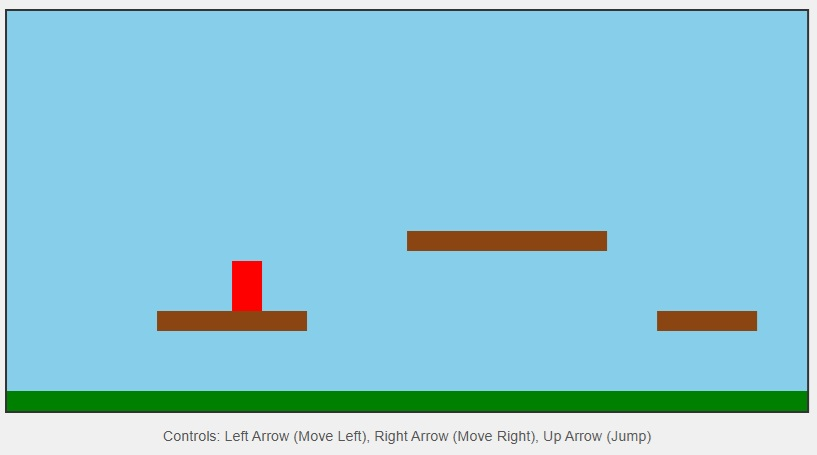

# platformer1

A simple platformer game built with HTML, CSS, and JavaScript.

**Play the game here:** [https://aurelius-in.github.io/platformer1/](https://aurelius-in.github.io/platformer1/)

## Screenshot



## Project Structure

The game is organized with the following file structure:

```
platformer-game/  (or your project root, e.g., platformer1/)
├── index.html      # Main HTML file for the game
├── style.css       # CSS for styling the game page
├── script.js       # JavaScript for game logic
├── platformer_screenshot.jpg # Screenshot of the game
└── assets/         # Optional directory for images, sounds, etc.
```

## How to Play

* **Left Arrow Key:** Move player left
* **Right Arrow Key:** Move player right
* **Up Arrow Key:** Make player jump (supports double jump)

## Development

This game was created as a basic example of a platformer using vanilla JavaScript and the HTML Canvas API.

### Core Concepts Implemented:
* Game Loop (`requestAnimationFrame`)
* 2D Rendering on Canvas
* Player Movement (left, right, jump)
* Basic Physics (gravity)
* Collision Detection (player with platforms)
* Keyboard Input Handling

## Future Enhancements (Ideas)
* Sprite sheets and animations
* Tile-based level design
* Enemies and collectibles
* Scrolling camera for larger levels
* Sound effects and music
